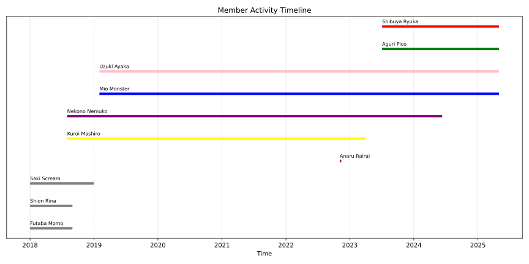
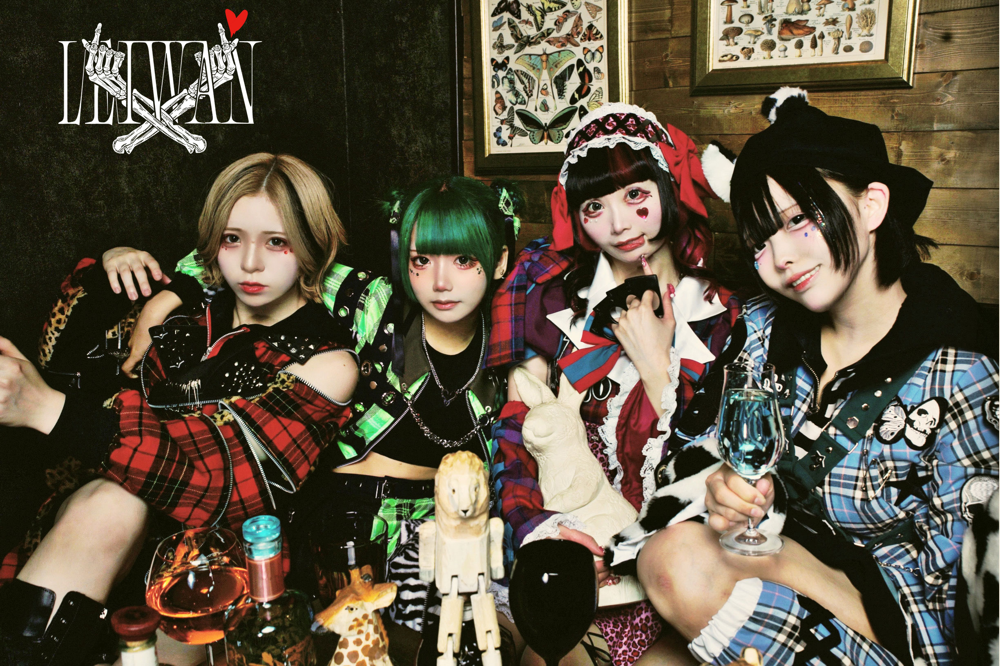
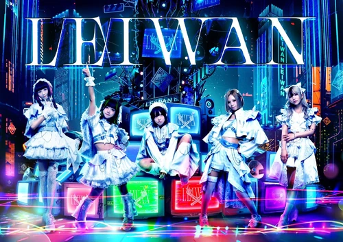
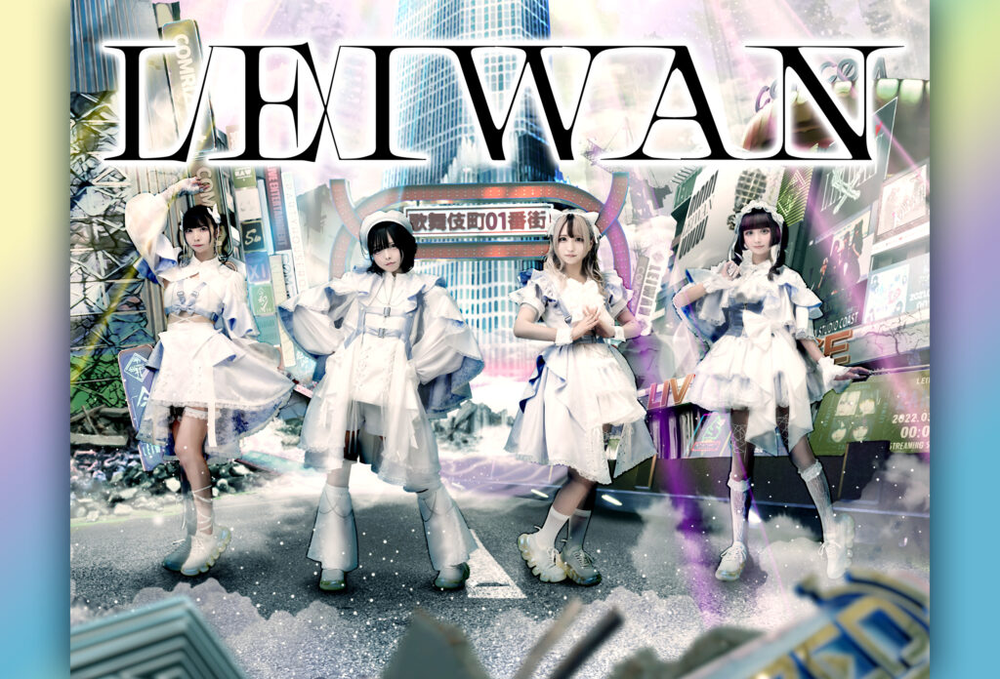
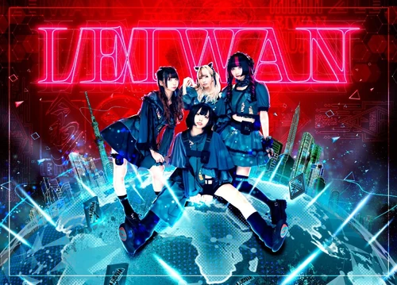
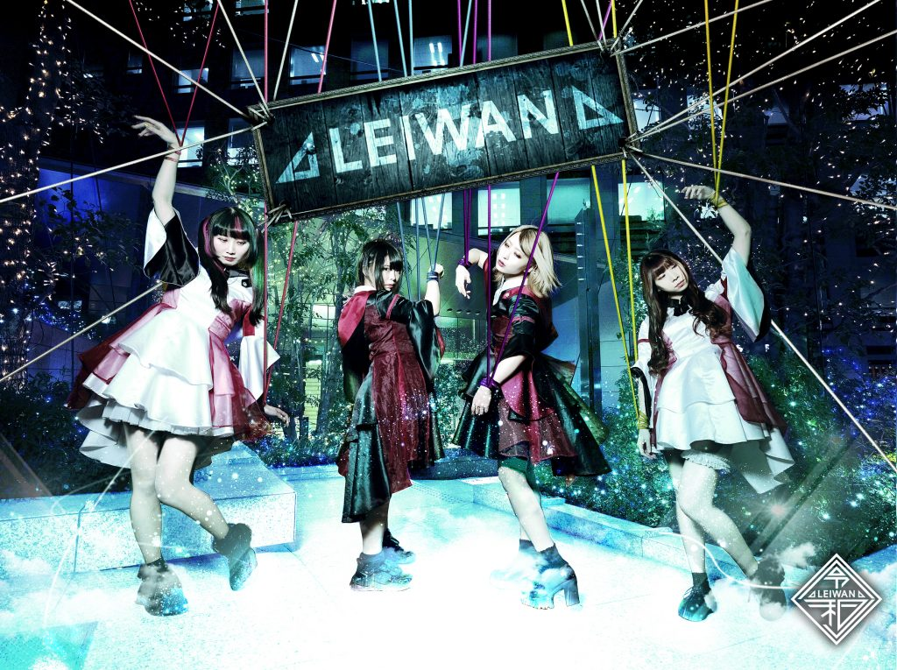
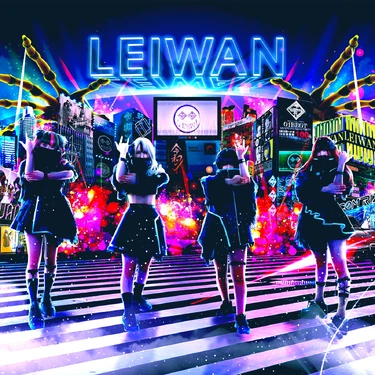

## Intro

`LEIWAN` (レイワン)  是成立于 2018 年的偶像团体. 她们最早使用 `AIQ` 的名号活动, 后于 2018 年 12 月停止活动. 此后于 2019 年初以 `Terror Rhythmn` (テロリズムン) 的名称从新出道. 在此后不久, 便更名为 `LEIWAN`.

`LEIWAN` 名称的由来为日本于 2019 年更改的年号 `令和 (Reiwa)`.

## Member

### `AIQ` 时期

- Futaba Momo (双葉モモ) (Original Member; Withdrew August 2018)
- Shion Rina (紫音リナ) (Original Member; Withdrew August 2018)
- Saki Scream (サキ・スクリーム) (Original Member; Graduated December 2018)
  
### `LEIWAN` 时期

- Anaru Rairai (愛成来来) (Joined November 4, 2022; Training ended November 13, 2022; Temporary Member)
- **Yellow**: [Kuroi Mashiro](#) 黒井マシロ (Original Member; Withdrew April 1, 2023)
- **Purple**: [Nekono Nemuko](#) 猫乃ねむ子 (Joined August 2018; Graduated June 11, 2024)
  
### `现体制`

- **Blue**: [Mio Monster](https://x.com/Mio_monster) 澪・モンスター (Joined February 2019)
- **Pink**: [Uzuki Ayaka](https://x.com/Uzuki_megane) 卯月彩華 (Joined February 2019; Leader)
- **Green**: [Aguri Pico](https://x.com/aguri_pico) あぐりぴこ (Joined July 4, 2023)
- **Red**: [Shibuya Ryuka](https://x.com/Shibuya_ryuka) 渋谷龍華 (Joined July 4, 2023)
  
### TimeLine

### Gallery

  
  
  
  
  
  

  <button onclick="prevImage()"><</button>
  <button onclick="nextImage()">></button>

## 
